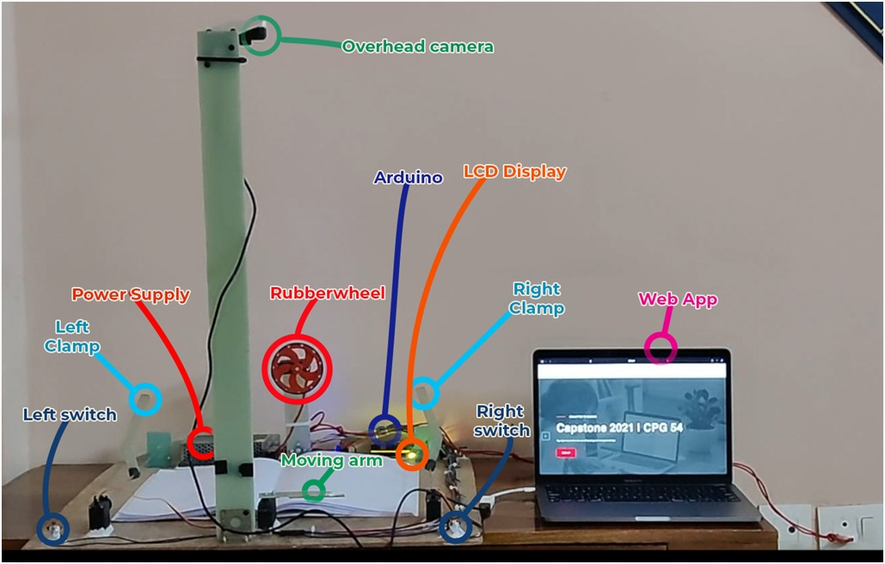
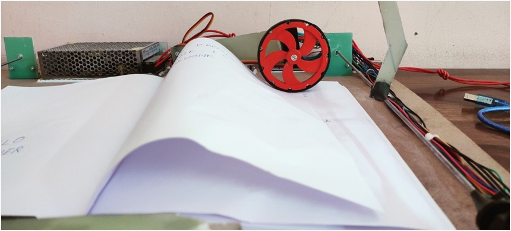
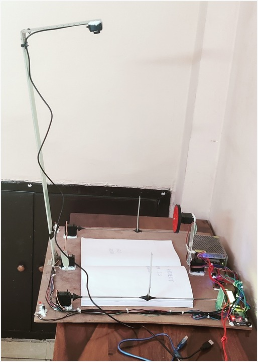
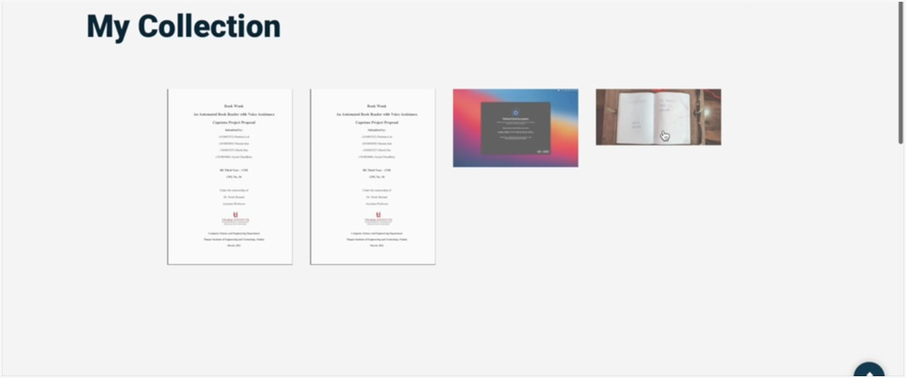
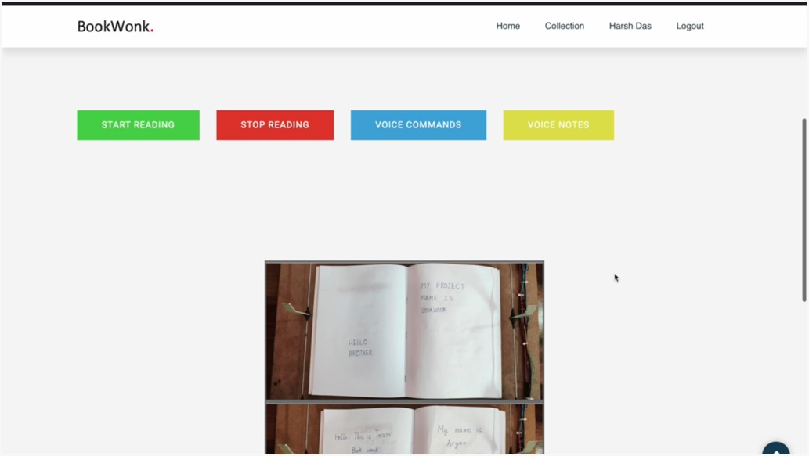

# BookWonk
Book Wonk – a Book Reader with an Automatic Page Turner and Voice Assistance

## Hardware:
Automated process - Hard copy -> Scanning -> Reading      
Features – Automatic Page Turner | Manual Start & Stop buttons

 
 
 
  
## Software:
Web application | User login  
Features: Voice Assistance (English) | Hardcopy to softcopy (pdf) conversion | Notes by voice  

 
 

